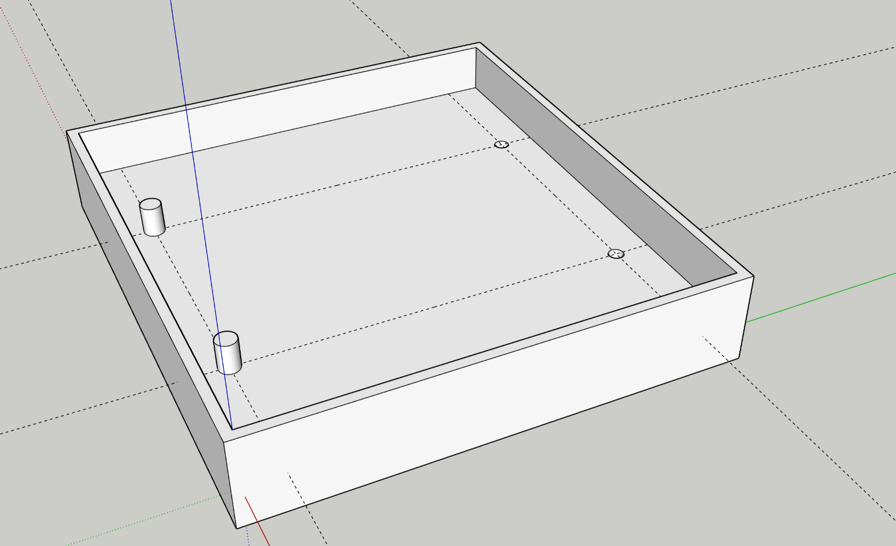

# 3D Printing

This folder contains the various 3D models and [Sketchup](https://www.sketchup.com/en) files used for the energy panel.

Some models are created at 10x scale to allow for easier editing in sketchup. Be sure to scale models down to 10% of their size where required.

None of the models should require supports.

## Prototype Board Double Mounting Plate

A simple mounting plate for a double column prototype board to allow for easier mounting and better electrical isolation.

There are 2 stands, and 2 holes for standard motherboard standoffs. The model avoids using 4 standoffs as the screws would be very close or touching multiple connectors potentially creating a short.

> :warning: Be sure to mount the board the correct orientation so that the screws avoid any of the live circuits!

The mounting plate can be glued to the back of the panel.
